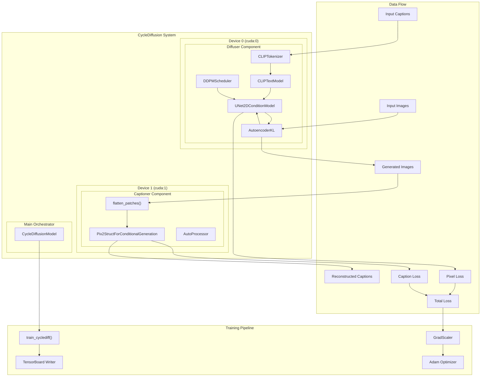

[](https://deepwiki.com/mariopenglee/cyclediffusion)
# [Read this DeepWiki for implementation details](https://deepwiki.com/mariopenglee/cyclediffusion/1-overview)

## Overview

CycleDiffusion is a deep learning architecture that implements a cycle-consistent training approach for bidirectional text-image generation. The project combines state-of-the-art Stable Diffusion models with Pix2Struct vision-language models to create a self-supervised learning framework that enforces consistency between text and image domains.

## Technical Requirements

The system requires:
- **Multi-GPU setup** (minimum 2 GPUs recommended)
- **CUDA-compatible hardware** with sufficient VRAM
- **PyTorch ecosystem** with diffusers, transformers, and accelerate libraries

## Getting Started

```bash
# Set up environment
export PYTHONPATH="/path/to/cyclediffusion:$PYTHONPATH"

# Launch training
python src/training/train_cyclediffusion.py

# Monitor with TensorBoard
tensorboard --logdir=./runs/
```

## Architecture Highlights

The system demonstrates several advanced ML engineering practices:
- **Modular component design** with clear separation of concerns
- **Device-aware tensor management** for multi-GPU efficiency
- **Comprehensive monitoring** and experiment tracking
- **Robust checkpoint management** with resume capabilities

Checkout the Deep Wiki for more details on implementation:
- [Overview](https://deepwiki.com/mariopenglee/cyclediffusion/1-overview)
- [Core Architecture](https://deepwiki.com/mariopenglee/cyclediffusion/2-core-architecture)
- [Training Systems](https://deepwiki.com/mariopenglee/cyclediffusion/3-training-systems)
- [Data Preparation](https://deepwiki.com/mariopenglee/cyclediffusion/4-data-preparation)
